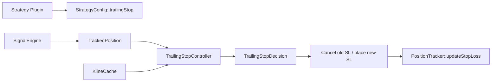

# Generic Trailing Stop Controller

**Version:** 1.0  
**Date:** 2026-05-15  
**Status:** Implemented

---

## 1. Goal

Provide trailing stop management as a generic engine capability, not as strategy-specific logic. Any strategy can enable it through `StrategyConfig::trailingStop` while keeping `IStrategy::evaluate()` stateless and ABI-stable.

---

## 2. Architecture



| Module | Role |
|---|---|
| `strategy::TrailingStopConfig` | Per-strategy generic config |
| `engine::TrackedPosition` | Per-position trailing state copied at entry time |
| `engine::TrailingStopController` | Pure calculation module, no order side effects |
| `engine::SignalEngine` | Runtime orchestration, order cancel/place, logging |
| `engine::PositionTracker` | Thread-safe persistence for updated stop ids and level |

---

## 3. Config Contract

```cpp
struct TrailingStopConfig {
    bool enabled{false};
    std::string interval;
    int candles{0};
    std::chrono::seconds checkInterval{300};
};
```

Strategy plugins may populate these fields from their own JSON parser. The engine reads only `StrategyConfig`; it does not inspect raw strategy params.

---

## 4. Runtime Flow

1. Strategy emits a normal Long/Short signal.
2. `SignalEngine::openPosition()` opens market position and places the initial SL.
3. Engine copies `StrategyConfig::trailingStop` into `TrackedPosition`.
4. `SignalEngine::monitorTrailingStops()` wakes periodically.
5. `TrailingStopController::evaluate()` computes a favorable new stop level from closed candles.
6. `SignalEngine::processTrailingStops()` cancels the old SL, places a new SL, then updates `PositionTracker`.

---

## 5. Calculation Rules

| Direction | Candidate trail level |
|---|---|
| Long | Lowest low of the last `N` closed candles |
| Short | Highest high of the last `N` closed candles |

Rules:

- Ignore candles where `Kline::isClosed == false`.
- Long stop moves only upward.
- Short stop moves only downward.
- If `currentTrailLevel == 0`, the first valid candidate can create the first trailing stop.
- If no closed candle exists for the configured interval, no decision is emitted.

---

## 6. Order Safety

`SignalEngine` must not create duplicate protective stops:

- Cancel by `slOrderId` first.
- Fallback to `slClientOrderId`.
- If cancel fails, skip new placement and retry next cycle.
- If no known SL id exists but `currentTrailLevel > 0`, skip placement because an unknown stop may already exist.
- Persist new stop id/client id only after placement is accepted.

---

## 7. Tests

Implemented coverage:

- Controller moves long stop using closed candles only.
- Controller skips unfavorable long move.
- Signal engine cancels old stop, places new stop, and persists tracker update.

Future coverage:

- Short trailing stop movement.
- Cancel failure leaves tracker unchanged.
- Missing interval does not place orders.
