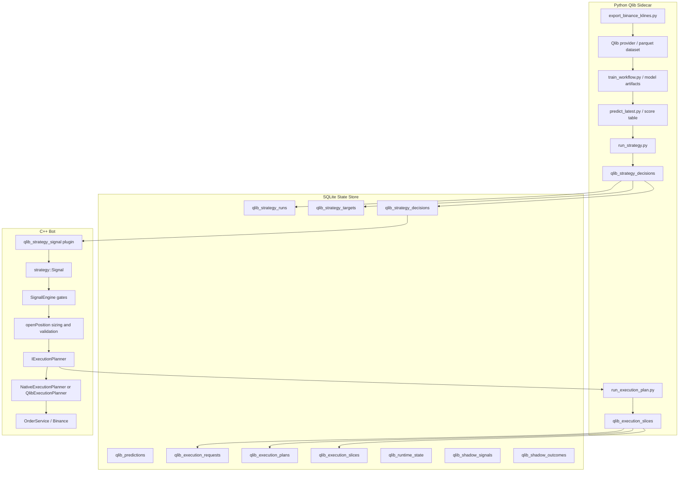

# Qlib Strategy Adapter Integration Design - v1.0

**Date:** 2026-05-21
**Status:** PROPOSED
**Disposition:** APPROVED by structured design review
**Audience:** AI agents, human developers

**Parent designs:**
- `docs/design/2026-05-20-qlib-integration-v1.0.md`
- `docs/design/2026-05-20-qlib-orchestration-v1.1.md`

**Related project areas:**
- `src/strategy/istrategy.h` - live strategy ABI and signal contract
- `src/engine/signal_engine.cpp` - signal gate, risk, and order path
- `plugins/src/qlib_model_signal/strategy_qlib_model_signal.cpp` - current Qlib score consumer
- `src/orchestration/qlib_state_store.h` - mutable Qlib runtime state
- `src/orchestration/shadow_metrics_recorder.h` - shadow signal metrics
- `tools/qlib_bridge/` - Python sidecar scripts
- `config.json` - static bot and strategy configuration

**External Qlib source reviewed:**
- Microsoft Qlib repository: https://github.com/microsoft/qlib
- Existing project review commit: `d5379c520f66a39953bad76234a7019a72796fd0`
- Strategy source paths reviewed:
  - `qlib/contrib/strategy/__init__.py`
  - `qlib/contrib/strategy/signal_strategy.py`
  - `qlib/contrib/strategy/cost_control.py`
  - `qlib/contrib/strategy/rule_strategy.py`
  - `qlib/rl/order_execution/strategy.py`
  - `qlib/rl/strategy/single_order.py`
  - `qlib/strategy/base.py`
  - `qlib/workflow/online/strategy.py`

---

## 1. Executive Summary

This design integrates Qlib's built-in strategy classes into the Binance trading bot through two explicit adapter layers:

1. **Alpha and portfolio strategy adapters** convert Qlib portfolio decisions into per-symbol `strategy::Signal` rows consumed by the existing C++ strategy plugin path.
2. **Execution and slicing adapters** convert approved bot orders into time-sliced execution plans generated by Qlib execution strategies, then revalidated by the C++ bot before any live order is sent.

The key architectural rule is unchanged from the parent Qlib designs:

**Do not run Python or Qlib inside `IStrategy::evaluate()` or the live order placement hot path.**

Qlib remains a Python sidecar that writes versioned artifacts and SQLite state. The C++ bot remains the source of truth for live Binance Futures connectivity, risk, exposure, leverage, stop loss, take profit, position tracking, shadow promotion, and fail-closed behavior.

This design intentionally does not replace the C++ live engine with Qlib backtest/executor. Qlib is used as a strategy decision engine and optional execution planner; the bot still owns live execution.

---

## 2. Understanding Summary

| Item | Decision |
|---|---|
| Requested scope | Integrate available Qlib strategies, including alpha/portfolio and execution/slicing strategies |
| Runtime boundary | Qlib runs as Python sidecar; C++ reads SQLite/artifacts |
| Live signal contract | Preserve `strategy::IStrategy::evaluate(...) -> strategy::Signal` |
| Live execution contract | C++ bot remains responsible for order placement and all safety gates |
| Initial alpha strategies | `TopkDropoutStrategy`, `SoftTopkStrategy`, optional `FileOrderStrategy` for replay |
| Initial execution strategy | `TWAPStrategy` |
| Deferred strategies | `EnhancedIndexingStrategy`, `ACStrategy`, `SBBStrategyEMA`, `SAOE*` |
| Shadow/promotion | Reuse current Qlib runtime state and shadow metrics model, generalized beyond `qlib_model_signal` |
| Failure policy | Missing, stale, invalid, or incomplete Qlib artifacts fail closed for Qlib-controlled behavior |

---

## 3. Goals

1. Allow the project to use Qlib's built-in portfolio strategies without changing the C++ strategy ABI.
2. Allow the project to use Qlib execution strategies without delegating live order placement to Qlib.
3. Keep all Python/Qlib work outside the critical `SignalEngine::processItem` and `openPosition` latency path.
4. Preserve current risk and gate semantics:
   - confidence gate
   - ATR fallback
   - tracked position de-duplication
   - exposure controls
   - order caps
   - Gemini gate
   - stop loss and take profit handling
   - shadow, live canary, live promotion modes
5. Provide a staged implementation path that can be tested in shadow mode before live activation.
6. Make strategy provenance auditable: every Qlib decision must record strategy id, run id, source strategy class, config hash, timestamp, and stale eligibility.

---

## 4. Non-Goals

1. Do not embed Python, pybind, or Qlib directly into the C++ bot binary.
2. Do not call Qlib from `IStrategy::evaluate()`.
3. Do not replace `SignalEngine` with Qlib's executor.
4. Do not use Qlib backtest PnL as live PnL.
5. Do not auto-promote execution slicing strategies until shadow metrics exist for the exact execution path.
6. Do not support all upstream Qlib strategies in the first implementation.
7. Do not let Qlib create live Binance orders directly.
8. Do not silently fall back from a failed Qlib execution plan to a market order unless a config flag explicitly permits that behavior.

---

## 5. Qlib Strategy Inventory And Classification

### 5.1 Exported `qlib.contrib.strategy` Classes

These are exported by `qlib/contrib/strategy/__init__.py`.

| Qlib class | Category | MVP status | Notes |
|---|---|---|---|
| `TopkDropoutStrategy` | Alpha/portfolio | Include first | Converts model scores into top-k holdings and n-drop turnover |
| `SoftTopkStrategy` | Alpha/portfolio | Include first | Top-k with budget-constrained weight changes and impact limit |
| `EnhancedIndexingStrategy` | Alpha/portfolio | Defer | Requires benchmark weights and risk model data not currently available for crypto futures |
| `TWAPStrategy` | Execution/slicing | Include first execution adapter | Splits an already-approved order over time |
| `SBBStrategyBase` | Execution/slicing base | Defer | Abstract base for select-better-bar execution |
| `SBBStrategyEMA` | Execution/slicing | Defer | Needs reliable intraday EMA signal data and extra validation |
| `WeightStrategyBase` | Base class | Support indirectly | Used by `SoftTopkStrategy` and `EnhancedIndexingStrategy` |

### 5.2 Source-Available But Not Exported In `__all__`

| Qlib class | Category | MVP status | Notes |
|---|---|---|---|
| `ACStrategy` | Execution/slicing | Defer | Almgren-Chriss style execution; needs volatility assumptions and instrument-specific calibration |
| `RandomOrderStrategy` | Test/dev only | Optional smoke test | Useful for adapter testing, not live trading |
| `FileOrderStrategy` | Replay/test | Include as offline replay only | Useful for deterministic acceptance tests |

### 5.3 RL Order Execution Classes

| Qlib class | Category | MVP status | Notes |
|---|---|---|---|
| `SAOEStrategy` | RL execution base | Defer | Requires policy lifecycle, RL env assumptions, and deeper validation |
| `ProxySAOEStrategy` | RL execution proxy | Defer | Useful for research only until operational controls exist |
| `SAOEIntStrategy` | RL execution with interpreters | Defer | Needs model governance and action constraints |
| `SingleOrderStrategy` | Simple execution strategy | Optional test | Can validate execution adapter shape |

### 5.4 Framework Classes

| Qlib class | Category | Decision |
|---|---|---|
| `BaseStrategy` | Framework | Not exposed directly to config |
| `RLStrategy` | Framework | Not exposed directly to config |
| `RLIntStrategy` | Framework | Not exposed directly to config |
| `OnlineStrategy` | Online workflow | Out of live strategy scope |
| `RollingStrategy` | Online workflow | May be useful later for retraining workflow, not trading signal execution |

---

## 6. Current Project Fit

The current live strategy contract is narrow:

```cpp
virtual Signal evaluate(
    std::string_view symbol,
    std::string_view interval,
    const std::vector<Kline>& klines) const = 0;
```

This is a per-symbol, per-interval signal contract. Qlib's portfolio strategies are cross-sectional and typically produce target holdings or order lists for a market universe. Therefore, the integration must convert Qlib portfolio decisions into per-symbol rows before C++ evaluation.

`SignalEngine::processItem` currently recognizes Qlib by:

```cpp
const bool isQlibStrategy = cfg.type == "qlib_model_signal";
```

This design generalizes that check to a Qlib strategy family:

```cpp
const bool isQlibStrategy = isQlibStrategyType(cfg.type);
```

Initial Qlib strategy types:

```text
qlib_model_signal
qlib_strategy_signal
```

Future execution planner support should not be represented as an `IStrategy` type. Execution slicing happens after a candidate signal has passed the bot's normal gates and sizing logic.

---

## 7. Target Architecture



---

## 8. Adapter Layer 1 - Alpha And Portfolio Strategies

### 8.1 Purpose

The alpha adapter turns a Qlib portfolio strategy result into per-symbol signal decisions that the existing C++ plugin system can consume.

Input:

- Qlib prediction scores from `qlib_predictions`
- universe symbols
- strategy config, such as `topk`, `n_drop`, `risk_degree`, `trade_impact_limit`
- current or simulated holdings, depending on mode

Output:

- per-symbol target weights
- per-symbol action intent
- direction and confidence rows for C++ consumption

### 8.2 Supported MVP Strategy Classes

#### `TopkDropoutStrategy`

Use when the bot should trade the strongest top-k symbols and replace up to `n_drop` symbols each run.

Mapping:

| Qlib output | C++ signal mapping |
|---|---|
| symbol newly enters target set | `Long` |
| symbol exits target set | `Short` only if shorting mode is enabled; otherwise `None` or close-only intent |
| symbol remains target | `None` if already tracked; otherwise `Long` if no position exists |
| rank/score | `confidence` using score percentile |

For futures, `Short` must be explicit. The default MVP behavior should be **long-only top-k** unless config enables `allow_short_targets`.

#### `SoftTopkStrategy`

Use when turnover needs to be controlled.

Mapping:

| Qlib concept | C++ treatment |
|---|---|
| target weight | desired per-symbol risk budget multiplier |
| trade impact limit | max target delta, not raw Binance order size |
| risk degree | maps to per-strategy risk budget cap |

The first MVP may ignore target weight for order sizing and use it only as confidence metadata. A later phase can pass `target_weight` into risk sizing if the C++ risk model supports weighted sizing.

#### `FileOrderStrategy`

Use only for deterministic replay tests and acceptance fixtures. It should not be exposed in live config unless `mode=dev`.

### 8.3 New Python Script

Path:

```text
tools/qlib_bridge/run_strategy.py
```

Responsibilities:

1. Load active model run metadata and latest predictions.
2. Load adapter config for a named `strategy_id`.
3. Instantiate an allowed Qlib strategy class from an allowlist.
4. Run the strategy over the configured universe and timestamp.
5. Write a versioned strategy run.
6. Write target weights and decisions.
7. Write a ready flag only after all DB writes commit.

Allowed classes for MVP:

```text
qlib.contrib.strategy.TopkDropoutStrategy
qlib.contrib.strategy.SoftTopkStrategy
qlib.contrib.strategy.rule_strategy.FileOrderStrategy
```

The runner must reject arbitrary class paths by default. Config-driven import must use an allowlist to avoid accidental or malicious execution of arbitrary Python code.

### 8.4 Strategy Decision Mapping

`run_strategy.py` writes normalized decisions:

| Field | Meaning |
|---|---|
| `strategy_id` | Stable adapter id from config |
| `run_id` | Unique sidecar run id |
| `model_id` | Source prediction model id |
| `model_run_id` | Active model run, if available |
| `symbol` | Binance symbol |
| `interval` | Bot interval |
| `asof_open_time_ms` | Candle open time the decision belongs to |
| `generated_at_ms` | Strategy decision generation time |
| `target_weight` | Desired portfolio weight, nullable |
| `score` | Source score, nullable |
| `score_percentile` | Source percentile, nullable |
| `action` | `buy`, `sell`, `hold`, `close`, `none` |
| `direction` | `long`, `short`, `none` |
| `confidence` | 0 to 1 |
| `reason` | Short diagnostic reason |

The C++ plugin must read only the latest eligible decision for `(strategy_id, symbol, interval)`.

---

## 9. Adapter Layer 2 - Execution And Slicing Strategies

### 9.1 Purpose

Execution adapters allow Qlib execution strategies to propose how an already-approved order should be split. They do not decide whether the bot should trade.

The C++ bot remains responsible for:

1. signal approval
2. risk sizing
3. leverage
4. exposure checks
5. position de-duplication
6. stop loss and take profit plan
7. final order placement

Qlib execution planners may only produce **order slices** for a parent order already approved by the bot.

### 9.2 MVP Strategy Class

#### `TWAPStrategy`

Initial execution adapter because it is simple, deterministic, and easy to validate.

Input:

- parent order id
- symbol
- side
- total quantity
- start time
- end time
- max number of slices
- min slice notional
- configured time range

Output:

- ordered slice schedule
- per-slice quantity
- per-slice valid time window
- stale deadline

### 9.3 Deferred Execution Classes

#### `ACStrategy`

Requires volatility estimates, market impact assumptions, and calibration per symbol. Add only after TWAP instrumentation is stable.

#### `SBBStrategyEMA`

Requires robust intraday EMA signal data and proof that the bar selection does not introduce stale or lookahead behavior.

#### `SAOEStrategy` / `SAOEIntStrategy`

Requires RL policy governance:

- model provenance
- action bounds
- deterministic replay
- policy drift checks
- kill switch
- clear simulation-to-live validation

This is out of MVP scope.

### 9.4 New C++ Interface

Add an execution planner abstraction:

```cpp
class IExecutionPlanner {
public:
    virtual ~IExecutionPlanner() = default;

    virtual ExecutionPlan planOrder(const ParentOrderRequest& request) = 0;
};
```

Initial implementations:

```text
NativeExecutionPlanner
QlibExecutionPlanner
```

`NativeExecutionPlanner` preserves current behavior. `QlibExecutionPlanner` writes a request to SQLite, waits for or reads a generated plan, validates slices, and returns a plan to the existing order path.

### 9.5 Execution Request Boundary

The C++ bot writes:

```text
qlib_execution_requests
```

Then Python sidecar writes:

```text
qlib_execution_plans
qlib_execution_slices
```

The C++ bot must revalidate every slice before submission:

1. request id matches current open decision
2. symbol matches parent order
3. side matches parent order
4. cumulative quantity does not exceed approved parent quantity
5. slice quantity meets exchange min quantity and min notional
6. slice time is not stale
7. position is still valid
8. exposure and order caps still allow submission
9. kill switch is not active

---

## 10. SQLite Schema

All tables live in the existing Qlib SQLite database.

### 10.1 `qlib_strategy_runs`

```sql
CREATE TABLE IF NOT EXISTS qlib_strategy_runs (
    run_id              TEXT PRIMARY KEY,
    strategy_id         TEXT NOT NULL,
    qlib_class          TEXT NOT NULL,
    config_hash         TEXT NOT NULL,
    model_id            TEXT,
    model_run_id        TEXT,
    interval            TEXT NOT NULL,
    universe_hash       TEXT NOT NULL,
    started_at_ms       INTEGER NOT NULL,
    completed_at_ms     INTEGER,
    status              TEXT NOT NULL CHECK (status IN ('running','succeeded','failed')),
    error               TEXT
);
```

### 10.2 `qlib_strategy_targets`

```sql
CREATE TABLE IF NOT EXISTS qlib_strategy_targets (
    run_id              TEXT NOT NULL,
    strategy_id         TEXT NOT NULL,
    symbol              TEXT NOT NULL,
    interval            TEXT NOT NULL,
    asof_open_time_ms   INTEGER NOT NULL,
    target_weight       REAL,
    previous_weight     REAL,
    weight_delta        REAL,
    rank                INTEGER,
    score               REAL,
    score_percentile    REAL,
    PRIMARY KEY (run_id, symbol, interval),
    FOREIGN KEY (run_id) REFERENCES qlib_strategy_runs(run_id)
);
```

### 10.3 `qlib_strategy_decisions`

```sql
CREATE TABLE IF NOT EXISTS qlib_strategy_decisions (
    strategy_id         TEXT NOT NULL,
    run_id              TEXT NOT NULL,
    model_id            TEXT,
    model_run_id        TEXT,
    symbol              TEXT NOT NULL,
    interval            TEXT NOT NULL,
    asof_open_time_ms   INTEGER NOT NULL,
    generated_at_ms     INTEGER NOT NULL,
    action              TEXT NOT NULL CHECK (action IN ('buy','sell','hold','close','none')),
    direction           TEXT NOT NULL CHECK (direction IN ('long','short','none')),
    target_weight       REAL,
    score               REAL,
    score_percentile    REAL,
    confidence          REAL NOT NULL,
    reason              TEXT,
    PRIMARY KEY (strategy_id, symbol, interval, asof_open_time_ms)
);

CREATE INDEX IF NOT EXISTS idx_qlib_strategy_decision_lookup
    ON qlib_strategy_decisions (strategy_id, symbol, interval, generated_at_ms DESC);
```

### 10.4 `qlib_execution_requests`

```sql
CREATE TABLE IF NOT EXISTS qlib_execution_requests (
    request_id          TEXT PRIMARY KEY,
    planner_id          TEXT NOT NULL,
    strategy_name       TEXT NOT NULL,
    symbol              TEXT NOT NULL,
    interval            TEXT NOT NULL,
    side                TEXT NOT NULL CHECK (side IN ('buy','sell')),
    quantity            REAL NOT NULL,
    current_price       REAL NOT NULL,
    requested_at_ms     INTEGER NOT NULL,
    deadline_ms         INTEGER NOT NULL,
    status              TEXT NOT NULL CHECK (status IN ('pending','planned','failed','expired','cancelled')),
    reason              TEXT
);
```

### 10.5 `qlib_execution_plans`

```sql
CREATE TABLE IF NOT EXISTS qlib_execution_plans (
    plan_id             TEXT PRIMARY KEY,
    request_id          TEXT NOT NULL,
    planner_id          TEXT NOT NULL,
    qlib_class          TEXT NOT NULL,
    config_hash         TEXT NOT NULL,
    generated_at_ms     INTEGER NOT NULL,
    expires_at_ms       INTEGER NOT NULL,
    status              TEXT NOT NULL CHECK (status IN ('succeeded','failed')),
    error               TEXT,
    FOREIGN KEY (request_id) REFERENCES qlib_execution_requests(request_id)
);
```

### 10.6 `qlib_execution_slices`

```sql
CREATE TABLE IF NOT EXISTS qlib_execution_slices (
    plan_id             TEXT NOT NULL,
    request_id          TEXT NOT NULL,
    slice_index         INTEGER NOT NULL,
    symbol              TEXT NOT NULL,
    side                TEXT NOT NULL CHECK (side IN ('buy','sell')),
    quantity            REAL NOT NULL,
    earliest_submit_ms  INTEGER NOT NULL,
    latest_submit_ms    INTEGER NOT NULL,
    status              TEXT NOT NULL CHECK (status IN ('pending','submitted','skipped','failed','expired')),
    submitted_order_id  TEXT,
    submitted_at_ms     INTEGER,
    reason              TEXT,
    PRIMARY KEY (plan_id, slice_index),
    FOREIGN KEY (plan_id) REFERENCES qlib_execution_plans(plan_id)
);
```

---

## 11. C++ Plugin - `qlib_strategy_signal`

### 11.1 Path

```text
plugins/src/qlib_strategy_signal/
  CMakeLists.txt
  strategy_qlib_strategy_signal.cpp
```

### 11.2 Strategy Type

```cpp
extern "C" __declspec(dllexport) const char* strategyType() {
    return "qlib_strategy_signal";
}
```

### 11.3 Config

```json
{
  "name": "Qlib TopK Dropout 30m",
  "type": "qlib_strategy_signal",
  "intervals": ["30m"],
  "scan_interval_seconds": 60,
  "max_hold_duration_seconds": 7200,
  "risk_pct": 0.005,
  "sl_multiplier": 1.5,
  "tp_multiplier": 2.0,
  "leverage": 5,
  "min_confidence": 0.60,
  "execution": {
    "mode_source": "sqlite",
    "default_mode": "shadow",
    "state_db_path": "data/qlib_smoke/qlib_predictions.db"
  },
  "params": {
    "source": "sqlite",
    "db_path": "data/qlib_smoke/qlib_predictions.db",
    "strategy_id": "topk_dropout_30m_v1",
    "max_artifact_age_seconds": 14400,
    "max_data_age_seconds": 5400,
    "allow_short_targets": false,
    "fail_mode": "closed"
  }
}
```

### 11.4 Evaluation Rules

For each `(symbol, interval)`:

1. Return `None` if interval is not configured.
2. Query latest `qlib_strategy_decisions` by `strategy_id`, `symbol`, and `interval`.
3. Return `None` if no row exists.
4. Fail closed if DB read fails and `fail_mode=closed`.
5. Enforce artifact age from `generated_at_ms`.
6. Enforce data age from `asof_open_time_ms`.
7. Map `direction`:
   - `long` -> `Signal::Direction::Long`
   - `short` -> `Signal::Direction::Short`
   - `none` -> `Signal::Direction::None`
8. Set `confidence` from normalized row confidence.
9. Include reason with strategy id, run id, target weight, score percentile, artifact age, and data age.

### 11.5 Reason Format

Example:

```text
qlib_strategy id=topk_dropout_30m_v1 run=20260521T120030Z score=0.0123 pct=0.97 target_weight=0.12 action=buy artifact_age_s=43 data_age_s=1800
```

---

## 12. Orchestration Changes

### 12.1 Config Shape

Extend `qlib_orchestration` with an `adapters` array:

```json
{
  "qlib_orchestration": {
    "enabled": true,
    "python_exe": ".venv-qlib/Scripts/python.exe",
    "scripts_dir": "tools/qlib_bridge",
    "db_path": "data/qlib_smoke/qlib_predictions.db",
    "adapters": [
      {
        "id": "topk_dropout_30m_v1",
        "role": "alpha",
        "qlib_class": "qlib.contrib.strategy.TopkDropoutStrategy",
        "interval": "30m",
        "model_id": "lightgbm_30m_v1",
        "schedule": "after_predict",
        "execution_mode": "shadow",
        "params": {
          "topk": 5,
          "n_drop": 1,
          "risk_degree": 0.95,
          "long_only": true
        }
      },
      {
        "id": "soft_topk_30m_v1",
        "role": "alpha",
        "qlib_class": "qlib.contrib.strategy.SoftTopkStrategy",
        "interval": "30m",
        "model_id": "lightgbm_30m_v1",
        "schedule": "after_predict",
        "execution_mode": "shadow",
        "params": {
          "topk": 5,
          "trade_impact_limit": 0.20,
          "risk_degree": 0.95
        }
      },
      {
        "id": "twap_exec_v1",
        "role": "execution",
        "qlib_class": "qlib.contrib.strategy.TWAPStrategy",
        "execution_mode": "shadow",
        "params": {
          "max_slices": 4,
          "max_duration_seconds": 900,
          "min_slice_notional": 5.0
        }
      }
    ]
  }
}
```

### 12.2 Scheduler Behavior

After `predict_latest.py` succeeds:

1. Enumerate enabled alpha adapters for the interval.
2. Invoke `run_strategy.py --adapter-id <id> --asof-ms <asof>`.
3. Commit strategy decisions.
4. Write a ready flag for strategy decisions.

Execution adapters are not run on candle close. They run only after the C++ bot creates an execution request for a specific approved parent order.

---

## 13. SignalEngine Changes

### 13.1 Generalize Qlib Strategy Detection

Replace hard-coded type checks:

```cpp
cfg.type == "qlib_model_signal"
```

with:

```cpp
bool isQlibStrategyType(std::string_view type) {
    return type == "qlib_model_signal" ||
           type == "qlib_strategy_signal";
}
```

This allows the same shadow metrics and runtime mode logic to apply to both score-based and strategy-based Qlib plugins.

### 13.2 Preserve Gate Order

The gate order must not change:

1. evaluate strategy
2. disabled mode check
3. `Direction::None` shadow record
4. confidence check
5. ATR check
6. price check
7. candidate signal logging
8. tracked position de-duplication
9. shadow/live/live canary mode handling
10. `openPosition`

### 13.3 Runtime State

`QlibStateStore` currently keys by `model_id` and `interval`. Strategy adapters need either:

Option A:

```text
model_id remains the runtime-state key
strategy_id is metadata only
```

Option B:

```text
runtime key becomes adapter_id + interval
```

Recommended: **Option B** for new tables, while keeping backward compatibility for `qlib_model_signal`.

Reason:

- `TopkDropoutStrategy` and `SoftTopkStrategy` can use the same model but have different promotion states.
- Execution adapters require independent mode control.

---

## 14. Execution Planner Changes

### 14.1 Native Planner

The existing behavior becomes the native default planner:

```text
SignalEngine openPosition -> NativeExecutionPlanner -> immediate order path
```

No behavior changes for existing non-Qlib strategies.

### 14.2 Qlib Planner

Configured per strategy or globally:

```json
{
  "execution_planner": {
    "type": "qlib",
    "planner_id": "twap_exec_v1",
    "fallback": "fail_closed"
  }
}
```

Plan flow:

1. `openPosition` computes approved parent quantity.
2. C++ writes `qlib_execution_requests`.
3. C++ invokes or waits for `run_execution_plan.py`.
4. Python writes plan and slices.
5. C++ validates all slices.
6. C++ submits slices on schedule.
7. C++ records slice status and order ids.

### 14.3 Fallback Modes

| Mode | Meaning | Default |
|---|---|---|
| `fail_closed` | Skip order if plan is missing/invalid/stale | Yes |
| `native` | Fall back to native immediate execution | No |
| `shadow_only` | Generate plan and metrics, but submit native order | Useful during rollout |

Live config must default to `fail_closed`.

---

## 15. Safety And Reliability Rules

1. All Qlib adapter classes must be allowlisted.
2. All sidecar scripts must use process timeout and log capture through `ProcessManager`.
3. All SQLite writes must be transactionally committed before ready flags are written.
4. C++ must treat missing rows as no signal or no execution plan.
5. C++ must treat DB read errors as fail closed for Qlib live behavior.
6. Stale strategy decisions must not produce signals.
7. Stale execution slices must not submit orders.
8. Execution slices must be revalidated immediately before order submission.
9. Qlib strategy config hash must be recorded for every run.
10. Promotion state must be per adapter, not only per model.
11. Existing non-Qlib strategies must keep current behavior.

---

## 16. Shadow Metrics And Promotion

### 16.1 Alpha Strategy Promotion

`qlib_strategy_signal` should reuse shadow metrics with additional metadata:

- `strategy_id`
- `adapter_role = alpha`
- `qlib_class`
- `target_weight`

Promotion criteria should use actual bot gate outcomes, as in the parent orchestration design:

- mature shadow signals
- hit rate
- net return after estimated costs
- stale ratio
- drift checks
- minimum count

### 16.2 Execution Strategy Promotion

Execution strategy promotion must be separate from alpha promotion.

Metrics:

- planned vs submitted slice count
- stale slice rate
- skipped slice rate
- average fill price vs native baseline
- slippage estimate
- completion ratio
- order rejection count
- time-to-complete

Execution planner promotion states:

```text
disabled -> shadow -> shadow_only -> live_canary -> live
```

`shadow_only` is important for execution because it lets Qlib produce plans while the bot still executes natively.

---

## 17. Rollout Plan

### Phase 1 - Schema And Read-Only Strategy Artifacts

Add:

- `qlib_strategy_runs`
- `qlib_strategy_targets`
- `qlib_strategy_decisions`
- `run_strategy.py`
- tests for decision mapping

No C++ behavior changes yet.

### Phase 2 - `qlib_strategy_signal` Plugin

Add C++ plugin that reads decisions and emits `strategy::Signal`.

Keep mode in shadow by default.

### Phase 3 - Generalize Qlib Shadow Metrics

Replace hard-coded `qlib_model_signal` checks with Qlib type helper.

Add `strategy_id` metadata to shadow records if needed.

### Phase 4 - TopK Alpha Shadow Run

Enable `TopkDropoutStrategy` on smoke symbols.

Acceptance:

- decisions written after each predict run
- C++ reads decisions
- shadow metrics record blocked stages and would-trade outcomes
- no live orders placed in shadow mode

### Phase 5 - SoftTopK Shadow Run

Enable `SoftTopkStrategy`.

Compare turnover, stale rate, and would-trade outcomes against TopK.

### Phase 6 - Execution Planner Interface

Add `IExecutionPlanner` with `NativeExecutionPlanner`.

No Qlib execution yet. Existing behavior must remain unchanged.

### Phase 7 - TWAP Shadow Planner

Add:

- execution request/plan/slice tables
- `run_execution_plan.py`
- `QlibExecutionPlanner` in `shadow_only`

### Phase 8 - TWAP Live Canary

Enable small canary risk multiplier only after execution shadow metrics pass thresholds.

### Phase 9 - Deferred Strategies

Evaluate:

- `ACStrategy`
- `SBBStrategyEMA`
- `EnhancedIndexingStrategy`
- `SAOEStrategy`

Each requires a separate design update before live use.

---

## 18. Testing Strategy

### 18.1 Python Unit Tests

Test:

- allowlist rejects unknown Qlib classes
- TopK mapping is deterministic
- SoftTopK respects impact limit
- missing predictions produce no decisions
- long-only mode never emits short direction
- config hash changes when strategy params change
- DB transactions rollback on failure

### 18.2 C++ Unit Tests

Test `qlib_strategy_signal`:

- no row returns `Direction::None`
- stale artifact returns `Direction::None`
- stale data returns `Direction::None`
- long row returns `Long`
- short row returns `Short` only when allowed
- confidence maps correctly
- DB errors fail closed when configured

### 18.3 Integration Tests

Test full alpha flow:

```text
predict_latest.py -> run_strategy.py -> qlib_strategy_signal -> SignalEngine shadow metrics
```

Test execution flow:

```text
openPosition approved parent -> qlib_execution_request -> run_execution_plan.py -> qlib_execution_slices -> C++ validation
```

### 18.4 Replay Tests

Use `FileOrderStrategy` to replay deterministic order intent and verify that generated rows produce expected C++ signals.

### 18.5 Safety Tests

Simulate:

- stale decision
- stale slice
- missing ready flag
- partially written DB rows
- invalid quantity
- side mismatch
- symbol mismatch
- process timeout
- Python crash
- SQLite locked
- mode changes from live to disabled between slices

---

## 19. Operational Observability

Log examples:

```text
[QLIB_STRATEGY][START] adapter=topk_dropout_30m_v1 class=TopkDropoutStrategy asof=...
[QLIB_STRATEGY][SUCCESS] adapter=topk_dropout_30m_v1 run=... decisions=12
[QLIB_STRATEGY][FAILED] adapter=topk_dropout_30m_v1 reason=...
[QLIB_EXEC][REQUEST] planner=twap_exec_v1 request=... symbol=BTCUSDT qty=...
[QLIB_EXEC][PLAN] planner=twap_exec_v1 request=... slices=4 expires=...
[QLIB_EXEC][SLICE_SKIPPED] request=... slice=2 reason=stale
```

Metrics:

- strategy decisions per run
- decision stale ratio
- target turnover
- shadow would-place count
- blocked stage distribution
- execution plan latency
- slice submission success rate
- execution fallback count

---

## 20. Risks And Mitigations

| Risk | Severity | Mitigation |
|---|---|---|
| Qlib portfolio strategy assumes equities, not crypto futures | High | Use adapter mapping, long-only default, shadow validation |
| Python sidecar delay creates stale decisions | High | Artifact/data age checks, ready flags, fail closed |
| Execution plan invalid at submit time | High | Revalidate each slice immediately before submission |
| Config-driven class import executes unintended code | High | Strict allowlist |
| TopK emits too many signals across symbols | Medium | Existing tracked-position de-dup plus per-adapter risk cap |
| Short semantics differ from sell/close semantics | Medium | Explicit `allow_short_targets`; separate `close` action |
| Promotion state shared by model hides strategy risk | Medium | Per-adapter runtime state |
| TWAP slices conflict with time exits or stop logic | Medium | Recheck position and kill switch before every slice |
| RL execution policy overfits simulation | High | Defer until separate governance design exists |

---

## 21. Decision Log

| # | Decision | Alternatives Considered | Resolution |
|---|---|---|---|
| 1 | Use two adapter layers | Single generic Qlib adapter | Accepted because alpha and execution strategies operate at different lifecycle stages |
| 2 | Keep Qlib out of `evaluate()` | Direct Python call from C++ plugin | Accepted because hot-path Python increases latency and failure risk |
| 3 | Add `qlib_strategy_signal` | Expand `qlib_model_signal` | Accepted to avoid mixing score and strategy-decision semantics |
| 4 | Use SQLite as adapter contract | JSON files or direct process IPC | Accepted to match existing Qlib design and support restart persistence |
| 5 | Start with TopK and SoftTopK | Support all Qlib strategies immediately | Accepted to reduce blast radius |
| 6 | Start execution with TWAP | Start with AC or RL execution | Accepted because TWAP is easiest to validate |
| 7 | Per-adapter runtime state | Reuse model-only runtime state | Accepted because multiple strategies can share one model |
| 8 | Fail closed by default | Native fallback on Qlib failure | Accepted for live safety |
| 9 | Defer EnhancedIndexing | Implement in MVP | Accepted because crypto benchmark/risk model is not ready |
| 10 | Defer SAOE/RL | Implement in MVP | Accepted because RL policy governance is not defined |

---

## 22. Structured Review Findings

### 22.1 Skeptic / Challenger

Objection: Qlib portfolio strategies are cross-sectional and equity-centric; the bot is per-symbol and futures-centric.

Resolution: Accepted. Add a normalized sidecar decision table that maps portfolio target state to per-symbol `Long`, `Short`, or `None`. Default to long-only until short semantics are explicitly validated.

Objection: Execution strategies may place slices after the market state has changed.

Resolution: Accepted. C++ revalidates every slice immediately before submission and fails closed on stale plans.

### 22.2 Constraint Guardian

Objection: Running Python in the live hot path violates performance and reliability constraints.

Resolution: Accepted. Python only writes artifacts and plans. C++ reads committed rows and enforces stale checks.

Objection: Arbitrary Qlib class paths create a code execution risk.

Resolution: Accepted. Use an allowlist, not arbitrary imports.

### 22.3 User Advocate

Objection: Exposing raw Qlib class names and many params in `config.json` increases operator cognitive load.

Resolution: Accepted. Provide curated adapter presets in docs and keep raw class support behind an allowlist.

Objection: It must be obvious why a Qlib signal did or did not trade.

Resolution: Accepted. Strategy reasons include adapter id, run id, action, target weight, percentile, and stale ages. Shadow metrics record blocked stage.

### 22.4 Arbiter Decision

The design is acceptable with the following mandatory constraints:

1. Alpha adapter must ship before execution adapter.
2. TopK/SoftTopK must run in shadow before live canary.
3. Execution adapter must start with TWAP only.
4. Runtime state must become per-adapter before multiple Qlib strategies are promoted.
5. Fail-closed behavior is mandatory for Qlib live execution.

---

## 23. Open Questions

1. Should TopK exits map to `close` only, or should the bot support explicit short reversal from Qlib portfolio decisions?
2. Should `target_weight` affect C++ order sizing in v1, or remain confidence metadata until the risk layer supports target-weight sizing?
3. Should Qlib execution planning be synchronous at open time or precomputed as an async worker that watches request rows?
4. Should adapter runtime state live in the existing `qlib_runtime_state` table with new columns, or in a new `qlib_adapter_runtime_state` table?
5. Should promotion thresholds differ between model-score signals and Qlib strategy-decision signals?

Recommended defaults:

1. Treat TopK exits as close-only in v1.
2. Keep target weight as metadata in v1.
3. Use synchronous process invocation for TWAP MVP, then move to async if latency becomes an issue.
4. Add a new `qlib_adapter_runtime_state` table.
5. Use separate promotion thresholds per adapter role.

---

## 24. Acceptance Criteria

The design is implemented when:

1. `run_strategy.py` can generate `qlib_strategy_decisions` for `TopkDropoutStrategy`.
2. `qlib_strategy_signal` can consume decisions and produce valid `strategy::Signal` objects.
3. `SignalEngine` treats `qlib_strategy_signal` as Qlib-managed for shadow/live state.
4. Shadow metrics record Qlib strategy signals with blocked stages.
5. Existing `qlib_model_signal` behavior remains unchanged.
6. Existing non-Qlib strategies remain unchanged.
7. TWAP execution planner can run in `shadow_only` without affecting live order placement.
8. Invalid or stale Qlib artifacts cannot place live orders.

---

## 25. Implementation Handoff

Recommended task breakdown:

1. Add schema migration helpers for strategy adapter tables.
2. Implement `tools/qlib_bridge/run_strategy.py` with TopK and SoftTopK allowlist.
3. Add tests for Python decision mapping.
4. Add `plugins/src/qlib_strategy_signal`.
5. Register plugin in CMake and sample config.
6. Generalize `SignalEngine` Qlib type detection.
7. Extend shadow metadata if needed for `strategy_id`.
8. Add adapter runtime state table.
9. Add `IExecutionPlanner` with native no-op behavior change.
10. Add TWAP execution planner in `shadow_only`.

