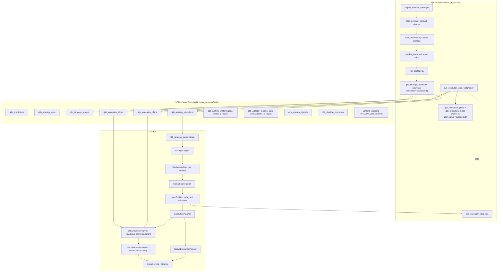

# Qlib Strategy Adapter Integration Design - v1.1

**Date:** 2026-05-21
**Status:** PROPOSED
**Disposition:** APPROVED by structured design review + brainstorming review
**Audience:** AI agents, human developers

**Parent designs:**
- `docs/design/2026-05-21-qlib-strategy-adapters-v1.0.md` (this is the immediate predecessor)
- `docs/design/2026-05-20-qlib-integration-v1.0.md`
- `docs/design/2026-05-20-qlib-orchestration-v1.1.md`

**Related project areas:**
- `src/strategy/istrategy.h` - live strategy ABI and signal contract
- `src/engine/signal_engine.cpp` - signal gate, risk, and order path
- `plugins/src/qlib_model_signal/strategy_qlib_model_signal.cpp` - current Qlib score consumer
- `src/orchestration/qlib_state_store.h` - mutable Qlib runtime state
- `src/orchestration/shadow_metrics_recorder.h` - shadow signal metrics
- `tools/qlib_bridge/` - Python sidecar scripts
- `config.json` - static bot and strategy configuration

**External Qlib source reviewed:**
- Microsoft Qlib repository: https://github.com/microsoft/qlib
- Existing project review commit: `d5379c520f66a39953bad76234a7019a72796fd0`
- Strategy source paths reviewed:
  - `qlib/contrib/strategy/__init__.py`
  - `qlib/contrib/strategy/signal_strategy.py`
  - `qlib/contrib/strategy/cost_control.py`
  - `qlib/contrib/strategy/rule_strategy.py`
  - `qlib/rl/order_execution/strategy.py`
  - `qlib/rl/strategy/single_order.py`
  - `qlib/strategy/base.py`
  - `qlib/workflow/online/strategy.py`

---

## 0. Changelog From v1.0

This v1.1 supersedes v1.0 after a structured brainstorming review. Thirteen substantive changes were made to address contradictions, implicit contracts, and production-risk gaps identified during the review. The high-level architecture (two adapter layers, Python sidecar, SQLite contract, fail-closed) is unchanged.

| # | Change | Sections touched |
|---|---|---|
| 1 | Execution planner switched from sync invocation to **async-only**. Python watcher pre-computes plans; C++ reads pre-committed plans like alpha decisions. Removes Python from the order placement hot path. | 1, 4, 7, 9.5, 14.2, 23 (OQ3 resolved) |
| 2 | Added **Decision Arbiter** layer in SignalEngine to consolidate conflicting decisions from multiple live adapters operating on the same `(model_id, interval)`. | 13.4 (new) |
| 3 | New **Database Connection Contract** section: mandatory WAL, `busy_timeout=5000ms`, atomic ready-flag via `run.status='succeeded'`, `PRAGMA user_version` schema negotiation, documented retry policy. | 10.0 (new) |
| 4 | TWAP slices now carry a **revocation contract**. C++ re-queries the latest strategic decision before each slice; cancels pending slices if direction reverses. New `revoked_at_ms`, `revoke_reason` columns on `qlib_execution_slices`. | 9.5, 10.6, 18.5 |
| 5 | v1 TopK adapter emits **only** `buy/hold/none`. No `close`, no `short` direction in v1. Exits remain SL/TP/time-exit driven. Schema `CHECK` constraint tightened. | 8.2, 10.3, 11.4, 23 (OQ1 resolved) |
| 6 | Added per-adapter **exposure caps**: `max_concurrent_positions`, `max_total_risk_pct` in adapter config, enforced before signals reach SignalEngine. | 11.3, 23 (OQ2 resolved as accept-with-cap) |
| 7 | Per-adapter runtime state goes in a **new `qlib_adapter_runtime_state` table**, leaving `qlib_runtime_state` unchanged for backward compatibility. Dual-table pattern explicit. | 13.3, 10.7 (new), 23 (OQ4 resolved) |
| 8 | Promotion thresholds vary by **`qlib_class`**, not just by role. Each adapter references a named `promotion_profile`. | 16.1, 16.2, 23 (OQ5 resolved) |
| 9 | Tighter default stale thresholds: `max_artifact_age = 2 × interval`, `max_data_age = 1.5 × interval`. Example config updated. | 11.3 |
| 10 | C++ **universe hash validation** at startup and on every run change. Mismatch → fail closed for that adapter. | 11.4, 15 |
| 11 | Qlib class allowlist is **hardcoded as a `frozenset`** in `run_strategy.py`, not in config. Operator-editable allowlist removed. | 8.3 |
| 12 | Rollout phases reordered: **Phase 6 (IExecutionPlanner abstraction) moves before Phase 4 (TopK shadow)**. Ship the abstraction with no behavior change first. | 17 |
| 13 | Acceptance criteria 9, 10, 11 added covering arbitration, DB contract verification, and revocation cancellation. | 24 |

---

## 1. Executive Summary

This design integrates Qlib's built-in strategy classes into the Binance trading bot through two explicit adapter layers:

1. **Alpha and portfolio strategy adapters** convert Qlib portfolio decisions into per-symbol `strategy::Signal` rows consumed by the existing C++ strategy plugin path. When multiple alpha adapters operate on the same `(model_id, interval)`, a **Decision Arbiter** consolidates their decisions before signals reach the live order path.
2. **Execution and slicing adapters** convert approved bot orders into time-sliced execution plans **pre-computed asynchronously** by Qlib execution strategies, then revalidated and revocable by the C++ bot before each slice is sent.

The key architectural rule is **strengthened** from v1.0:

**No Python or Qlib in `IStrategy::evaluate()`, the live order placement hot path, *or any synchronous call site touching live order flow*.**

Qlib remains a Python sidecar that writes versioned artifacts and SQLite state. The C++ bot remains the source of truth for live Binance Futures connectivity, risk, exposure, leverage, stop loss, take profit, position tracking, shadow promotion, and fail-closed behavior.

This design intentionally does not replace the C++ live engine with Qlib backtest/executor. Qlib is used as a strategy decision engine and asynchronous execution planner; the bot still owns live execution.

---

## 2. Understanding Summary

| Item | Decision |
|---|---|
| Requested scope | Integrate available Qlib strategies, including alpha/portfolio and execution/slicing strategies |
| Runtime boundary | Qlib runs as Python sidecar; C++ reads SQLite/artifacts; **no synchronous Python invocation from C++ in the order path** |
| Live signal contract | Preserve `strategy::IStrategy::evaluate(...) -> strategy::Signal` |
| Live execution contract | C++ bot remains responsible for order placement and all safety gates |
| Multi-adapter coordination | Decision Arbiter consolidates per-symbol intent before SignalEngine acts |
| Initial alpha strategies | `TopkDropoutStrategy`, `SoftTopkStrategy`, optional `FileOrderStrategy` for replay |
| Initial execution strategy | `TWAPStrategy` with revocation contract |
| Deferred strategies | `EnhancedIndexingStrategy`, `ACStrategy`, `SBBStrategyEMA`, `SAOE*` |
| Shadow/promotion | Per-adapter runtime state; promotion profiles per `qlib_class` |
| Failure policy | Missing, stale, invalid, or incomplete Qlib artifacts fail closed for Qlib-controlled behavior |
| SQLite contract | WAL, atomic ready-flag, schema versioning, retry policy mandatory |

---

## 3. Goals

1. Allow the project to use Qlib's built-in portfolio strategies without changing the C++ strategy ABI.
2. Allow the project to use Qlib execution strategies without delegating live order placement to Qlib and without injecting Python latency into the order path.
3. Keep all Python/Qlib work outside the critical `SignalEngine::processItem` and `openPosition` latency path. **Async-only execution planning is mandatory.**
4. Preserve current risk and gate semantics:
   - confidence gate
   - ATR fallback
   - tracked position de-duplication
   - exposure controls (now augmented by per-adapter exposure caps)
   - order caps
   - Gemini gate
   - stop loss and take profit handling
   - shadow, live canary, live promotion modes
5. Provide a staged implementation path that can be tested in shadow mode before live activation.
6. Make strategy provenance auditable: every Qlib decision must record strategy id, run id, source strategy class, config hash, timestamp, and stale eligibility.
7. Make SQLite contract failure modes explicit and verified at startup (schema version, WAL).

---

## 4. Non-Goals

1. Do not embed Python, pybind, or Qlib directly into the C++ bot binary.
2. Do not call Qlib from `IStrategy::evaluate()`.
3. **Do not call Python synchronously from `openPosition` or any code path that holds live order intent.** Execution plans must already exist in SQLite when C++ needs them.
4. Do not replace `SignalEngine` with Qlib's executor.
5. Do not use Qlib backtest PnL as live PnL.
6. Do not auto-promote execution slicing strategies until shadow metrics exist for the exact execution path.
7. Do not support all upstream Qlib strategies in the first implementation.
8. Do not let Qlib create live Binance orders directly.
9. Do not silently fall back from a failed Qlib execution plan to a market order unless a config flag explicitly permits that behavior.
10. Do not emit `Short` or `Close` actions from `qlib_strategy_signal` in v1 — these are deferred to a later phase with explicit design.

---

## 5. Qlib Strategy Inventory And Classification

Unchanged from v1.0. See v1.0 Section 5 for full inventory. MVP first-class set:

- `TopkDropoutStrategy` (alpha)
- `SoftTopkStrategy` (alpha)
- `TWAPStrategy` (execution, async-only)
- `FileOrderStrategy` (replay tests only)

---

## 6. Current Project Fit

Unchanged from v1.0. The per-symbol `IStrategy::evaluate` contract is preserved. Qlib portfolio decisions are converted into per-symbol rows by the Python sidecar before C++ evaluation.

`SignalEngine::processItem` Qlib-family check is generalized:

```cpp
bool isQlibStrategyType(std::string_view type) {
    return type == "qlib_model_signal" ||
           type == "qlib_strategy_signal";
}
```

---

## 7. Target Architecture



Key differences from v1.0:
- `run_execution_plan_watcher.py` runs as a long-lived watcher; C++ only writes `qlib_execution_requests` and reads back plans/slices when ready.
- A Decision Arbiter sits between the plugin and SignalEngine gates.
- `qlib_adapter_runtime_state` is a new table; `qlib_runtime_state` retained for legacy `qlib_model_signal`.

---

## 8. Adapter Layer 1 - Alpha And Portfolio Strategies

### 8.1 Purpose

Unchanged from v1.0. The alpha adapter turns a Qlib portfolio strategy result into per-symbol decisions consumable by C++.

### 8.2 Supported MVP Strategy Classes

#### `TopkDropoutStrategy` (v1 mapping — long-only, no close emission)

| Qlib output | v1 C++ signal mapping |
|---|---|
| symbol newly enters target set | `Long` |
| symbol exits target set | `None` (exit driven by SL/TP/time-exit, not strategy) |
| symbol remains target | `None` if already tracked; `Long` if no position exists |
| rank/score | `confidence` from score percentile |

`Short` direction and `Close` action are deferred to a later phase. v1 never emits them. The schema CHECK constraint is tightened accordingly (Section 10.3).

#### `SoftTopkStrategy`

Unchanged mapping from v1.0. Target weight remains confidence metadata in v1. Exposure is bounded by the new per-adapter caps (Section 11.3).

#### `FileOrderStrategy`

Replay/test only. Not exposed in live config.

### 8.3 New Python Script

Path: `tools/qlib_bridge/run_strategy.py`

**Allowlist enforcement:** the set of permitted Qlib classes is hardcoded in the script as a Python `frozenset`. The config can name a class but not extend the allowlist.

```python
# tools/qlib_bridge/run_strategy.py
ALLOWED_QLIB_STRATEGY_CLASSES: frozenset[str] = frozenset({
    "qlib.contrib.strategy.TopkDropoutStrategy",
    "qlib.contrib.strategy.SoftTopkStrategy",
    "qlib.contrib.strategy.rule_strategy.FileOrderStrategy",
})

def _resolve_strategy_class(qlib_class: str):
    if qlib_class not in ALLOWED_QLIB_STRATEGY_CLASSES:
        raise ValueError(f"Qlib class not in allowlist: {qlib_class}")
    module_name, _, class_name = qlib_class.rpartition(".")
    return getattr(importlib.import_module(module_name), class_name)
```

Operator cannot widen the allowlist without code change + PR + redeploy. Config-driven class names are still useful for selecting *among* allowed classes.

### 8.4 Strategy Decision Mapping

Schema unchanged from v1.0 except for the `action` CHECK constraint (Section 10.3). For v1, `qlib_strategy_decisions.action` is one of `buy | hold | none`.

---

## 9. Adapter Layer 2 - Execution And Slicing Strategies

### 9.1 Purpose

Execution adapters propose how an already-approved order should be split. C++ owns approval, sizing, leverage, exposure, dedup, SL/TP, and final placement. Qlib execution planners produce **order slices** only.

### 9.2 MVP Strategy Class

`TWAPStrategy` — deterministic, easy to validate, asynchronous.

### 9.3 Deferred Execution Classes

Unchanged from v1.0: `ACStrategy`, `SBBStrategyEMA`, `SAOEStrategy`, `SAOEIntStrategy` all deferred.

### 9.4 New C++ Interface

```cpp
class IExecutionPlanner {
public:
    virtual ~IExecutionPlanner() = default;
    virtual ExecutionPlan planOrder(const ParentOrderRequest& request) = 0;
};
```

Implementations:
- `NativeExecutionPlanner` — single immediate slice, preserves current behavior.
- `QlibExecutionPlanner` — **reads pre-computed plan from SQLite. Never invokes Python.** If no plan is ready by deadline → fail closed.

### 9.5 Execution Request Boundary (Async)

The flow is fully async. C++ never blocks on a Python subprocess:

1. `openPosition` computes approved parent quantity.
2. C++ writes `qlib_execution_requests` row with `status='pending'` and a `deadline_ms`.
3. C++ polls `qlib_execution_plans` joined on `request_id` with short timeout (e.g., 500ms total).
4. **If plan is ready (`plans.status='succeeded'` AND not expired):** C++ validates all slices.
5. **If plan is not ready by C++ poll deadline:** behavior depends on `fallback` config:
   - `fail_closed` (default for live) → skip order; mark request `status='expired'`.
   - `native` → fall back to `NativeExecutionPlanner` (single immediate slice).
   - `shadow_only` → request was diagnostic only; native plan is always used regardless.
6. **Revalidation per slice** (mandatory):
   1. request id matches current open decision
   2. symbol matches parent order
   3. side matches parent order
   4. cumulative quantity does not exceed approved parent quantity
   5. slice quantity meets exchange min quantity and min notional
   6. slice time is not stale
   7. position is still valid (tracker-checked)
   8. exposure and order caps still allow submission
   9. kill switch is not active
   10. **revocation re-query:** the *current* `qlib_strategy_decisions` row for the symbol does not contradict the parent order's direction. If it does (e.g., direction reversed, or another live adapter emitted opposite intent), remaining slices are canceled and marked `revoked`.

The watcher `run_execution_plan_watcher.py` polls `qlib_execution_requests` where `status='pending'`, generates the plan, writes plan + slices in a single transaction, then sets `plan.status='succeeded'`. The atomic flag mechanism (Section 10.0) guarantees C++ never sees half-written plans.

---

## 10. SQLite Schema

### 10.0 Database Connection Contract (NEW)

Both runtimes MUST configure the database identically at connection open. Mismatch breaks WAL guarantees.

**Mandatory PRAGMAs (both C++ and Python):**

```sql
PRAGMA journal_mode = WAL;
PRAGMA busy_timeout = 5000;
PRAGMA foreign_keys = ON;
PRAGMA synchronous = NORMAL;
```

**Transaction discipline:**

| Runtime | Read transactions | Write transactions |
|---|---|---|
| Python | `BEGIN` (deferred) for queries | `BEGIN IMMEDIATE` for writes |
| C++ | `BEGIN DEFERRED` (read-only) | n/a — C++ writes only to `qlib_execution_requests` and slice status updates |

**Atomic ready-flag mechanism:**

Every multi-row write completes in a single transaction whose final statement updates a "status" column to `'succeeded'`. C++ readers MUST filter `WHERE status='succeeded'` and treat any other status as not-yet-ready or failed.

The ready-flag is therefore embedded in the existing `qlib_strategy_runs.status` and `qlib_execution_plans.status` columns — no separate flag table.

**Schema version negotiation:**

The schema version is tracked via `PRAGMA user_version`. The Python migrator sets the version when applying migrations. The C++ bot reads `PRAGMA user_version` at startup and refuses to operate if the value differs from its compiled-in expected version. This produces a loud, immediate startup failure on schema drift rather than silent column-mismatch corruption.

```cpp
// at startup
constexpr int kExpectedSchemaVersion = 7;  // bumped per migration
int actual = readUserVersion(db);
if (actual != kExpectedSchemaVersion) {
    FAIL_CLOSED("schema version mismatch: expected " +
                std::to_string(kExpectedSchemaVersion) +
                " got " + std::to_string(actual));
}
```

**Retry policy (C++):**

On `SQLITE_BUSY` during a read:
1. Retry after 50ms
2. Retry after 200ms
3. Retry after 500ms
4. Then fail closed for that read (return `Direction::None` + reason `db_busy`)

Python relies on `busy_timeout=5000ms` which the driver enforces transparently.

### 10.1 `qlib_strategy_runs` (unchanged)

```sql
CREATE TABLE IF NOT EXISTS qlib_strategy_runs (
    run_id              TEXT PRIMARY KEY,
    strategy_id         TEXT NOT NULL,
    qlib_class          TEXT NOT NULL,
    config_hash         TEXT NOT NULL,
    model_id            TEXT,
    model_run_id        TEXT,
    interval            TEXT NOT NULL,
    universe_hash       TEXT NOT NULL,
    started_at_ms       INTEGER NOT NULL,
    completed_at_ms     INTEGER,
    status              TEXT NOT NULL CHECK (status IN ('running','succeeded','failed')),
    error               TEXT
);
```

Note: `status='succeeded'` is the atomic ready-flag. Writes are committed only after all `qlib_strategy_targets` and `qlib_strategy_decisions` rows are inserted, all in the same transaction.

### 10.2 `qlib_strategy_targets` (unchanged)

Schema unchanged from v1.0.

### 10.3 `qlib_strategy_decisions` (CHECK tightened for v1)

```sql
CREATE TABLE IF NOT EXISTS qlib_strategy_decisions (
    strategy_id         TEXT NOT NULL,
    run_id              TEXT NOT NULL,
    model_id            TEXT,
    model_run_id        TEXT,
    symbol              TEXT NOT NULL,
    interval            TEXT NOT NULL,
    asof_open_time_ms   INTEGER NOT NULL,
    generated_at_ms     INTEGER NOT NULL,
    action              TEXT NOT NULL CHECK (action IN ('buy','hold','none')),
    direction           TEXT NOT NULL CHECK (direction IN ('long','none')),
    target_weight       REAL,
    score               REAL,
    score_percentile    REAL,
    confidence          REAL NOT NULL,
    reason              TEXT,
    PRIMARY KEY (strategy_id, symbol, interval, asof_open_time_ms)
);

CREATE INDEX IF NOT EXISTS idx_qlib_strategy_decision_lookup
    ON qlib_strategy_decisions (strategy_id, symbol, interval, generated_at_ms DESC);
```

`sell`, `close`, `short` are excluded in v1. Adding them later requires a schema migration that widens the CHECK and bumps `PRAGMA user_version`.

### 10.4 `qlib_execution_requests` (unchanged)

Schema unchanged from v1.0.

### 10.5 `qlib_execution_plans` (unchanged)

Schema unchanged from v1.0. `status='succeeded'` is the atomic ready-flag for the plan + its slices.

### 10.6 `qlib_execution_slices` (new revocation columns)

```sql
CREATE TABLE IF NOT EXISTS qlib_execution_slices (
    plan_id             TEXT NOT NULL,
    request_id          TEXT NOT NULL,
    slice_index         INTEGER NOT NULL,
    symbol              TEXT NOT NULL,
    side                TEXT NOT NULL CHECK (side IN ('buy','sell')),
    quantity            REAL NOT NULL,
    earliest_submit_ms  INTEGER NOT NULL,
    latest_submit_ms    INTEGER NOT NULL,
    status              TEXT NOT NULL CHECK (status IN ('pending','submitted','skipped','failed','expired','revoked')),
    submitted_order_id  TEXT,
    submitted_at_ms     INTEGER,
    revoked_at_ms       INTEGER,
    revoke_reason       TEXT,
    reason              TEXT,
    PRIMARY KEY (plan_id, slice_index),
    FOREIGN KEY (plan_id) REFERENCES qlib_execution_plans(plan_id)
);
```

Added `'revoked'` status and `revoked_at_ms` + `revoke_reason` columns to support per-slice revocation when the strategic decision reverses mid-TWAP.

### 10.7 `qlib_adapter_runtime_state` (NEW)

```sql
CREATE TABLE IF NOT EXISTS qlib_adapter_runtime_state (
    adapter_id          TEXT NOT NULL,
    interval            TEXT NOT NULL,
    execution_mode      TEXT NOT NULL CHECK (execution_mode IN
        ('disabled','shadow','shadow_only','live_canary','live')),
    promotion_profile   TEXT NOT NULL,
    promoted_at_ms      INTEGER,
    promoted_by         TEXT,
    last_decision_at_ms INTEGER,
    last_failure_at_ms  INTEGER,
    last_failure_reason TEXT,
    PRIMARY KEY (adapter_id, interval)
);
```

Legacy `qlib_runtime_state` (keyed by `model_id`, `interval`) remains untouched. The `qlib_model_signal` plugin continues to read it. The new `qlib_strategy_signal` plugin reads `qlib_adapter_runtime_state`. Backward compatibility preserved.

---

## 11. C++ Plugin - `qlib_strategy_signal`

### 11.1 Path

```text
plugins/src/qlib_strategy_signal/
  CMakeLists.txt
  strategy_qlib_strategy_signal.cpp
```

### 11.2 Strategy Type

```cpp
extern "C" __declspec(dllexport) const char* strategyType() {
    return "qlib_strategy_signal";
}
```

### 11.3 Config (updated example with tighter defaults + exposure caps)

```json
{
  "name": "Qlib TopK Dropout 30m",
  "type": "qlib_strategy_signal",
  "intervals": ["30m"],
  "scan_interval_seconds": 60,
  "max_hold_duration_seconds": 7200,
  "risk_pct": 0.005,
  "sl_multiplier": 1.5,
  "tp_multiplier": 2.0,
  "leverage": 5,
  "min_confidence": 0.60,
  "execution": {
    "mode_source": "sqlite",
    "default_mode": "shadow",
    "state_db_path": "data/qlib_smoke/qlib_predictions.db"
  },
  "params": {
    "source": "sqlite",
    "db_path": "data/qlib_smoke/qlib_predictions.db",
    "strategy_id": "topk_dropout_30m_v1",
    "max_artifact_age_seconds": 3600,
    "max_data_age_seconds": 2700,
    "max_concurrent_positions": 5,
    "max_total_risk_pct": 0.025,
    "universe_hash_strict": true,
    "fail_mode": "closed"
  }
}
```

Stale defaults now follow the formula `max_artifact_age = 2 × interval_seconds`, `max_data_age = 1.5 × interval_seconds`. For 30m (1800s): artifact ≤ 3600s, data ≤ 2700s.

`max_concurrent_positions` and `max_total_risk_pct` are enforced at the adapter level. The adapter tracks how many of its own signals currently have open positions and how much aggregate risk they represent. New signals are rejected once either cap is hit.

`universe_hash_strict: true` enables Section 11.4 step 1.5 below.

### 11.4 Evaluation Rules

For each `(symbol, interval)`:

1. Return `None` if interval is not configured.
1.5. **Universe hash check** (new). Query the latest `qlib_strategy_runs.universe_hash` for this `strategy_id`. Compare to the bot's current trading universe hash. If `universe_hash_strict` is true and the values differ, fail closed for this adapter and log `[QLIB_STRATEGY][UNIVERSE_DRIFT]`.
2. Query latest `qlib_strategy_decisions` joined to `qlib_strategy_runs WHERE status='succeeded'`. Filter by `strategy_id`, `symbol`, `interval`.
3. Return `None` if no row exists.
4. Fail closed if DB read fails after retry (Section 10.0).
5. Enforce `max_artifact_age_seconds` from `generated_at_ms`.
6. Enforce `max_data_age_seconds` from `asof_open_time_ms`.
7. Map `direction`:
   - `long` → `Signal::Direction::Long`
   - `none` → `Signal::Direction::None`
   - (no `short` in v1)
8. **Exposure cap check:** if accepting this signal would breach `max_concurrent_positions` or `max_total_risk_pct`, return `None` with reason `exposure_cap_breached`.
9. Set `confidence` from normalized row confidence.
10. Include reason with strategy id, run id, target weight, score percentile, artifact age, data age, and universe hash status.

### 11.5 Reason Format

```text
qlib_strategy id=topk_dropout_30m_v1 run=20260521T120030Z score=0.0123 pct=0.97 target_weight=0.12 action=buy artifact_age_s=43 data_age_s=1800 universe_ok=true open_positions=2/5
```

---

## 12. Orchestration Changes

### 12.1 Config Shape (updated)

```json
{
  "qlib_orchestration": {
    "enabled": true,
    "python_exe": ".venv-qlib/Scripts/python.exe",
    "scripts_dir": "tools/qlib_bridge",
    "db_path": "data/qlib_smoke/qlib_predictions.db",
    "execution_plan_watcher": {
      "enabled": true,
      "poll_interval_ms": 250,
      "max_inflight_requests": 16
    },
    "adapters": [
      {
        "id": "topk_dropout_30m_v1",
        "role": "alpha",
        "qlib_class": "qlib.contrib.strategy.TopkDropoutStrategy",
        "interval": "30m",
        "model_id": "lightgbm_30m_v1",
        "schedule": "after_predict",
        "execution_mode": "shadow",
        "promotion_profile": "alpha_topk_dropout_default",
        "params": {
          "topk": 5,
          "n_drop": 1,
          "risk_degree": 0.95,
          "long_only": true
        }
      },
      {
        "id": "soft_topk_30m_v1",
        "role": "alpha",
        "qlib_class": "qlib.contrib.strategy.SoftTopkStrategy",
        "interval": "30m",
        "model_id": "lightgbm_30m_v1",
        "schedule": "after_predict",
        "execution_mode": "shadow",
        "promotion_profile": "alpha_soft_topk_default",
        "params": {
          "topk": 5,
          "trade_impact_limit": 0.20,
          "risk_degree": 0.95
        }
      },
      {
        "id": "twap_exec_v1",
        "role": "execution",
        "qlib_class": "qlib.contrib.strategy.TWAPStrategy",
        "execution_mode": "shadow_only",
        "promotion_profile": "exec_twap_default",
        "params": {
          "max_slices": 4,
          "max_duration_seconds": 600,
          "min_slice_notional": 5.0
        }
      }
    ]
  }
}
```

Changes vs v1.0:
- `execution_plan_watcher` config controls the new async watcher process.
- Every adapter has a `promotion_profile` reference.
- `twap_exec_v1` uses `max_duration_seconds=600` (bounded < interval/3 for safety; the revocation contract handles the rest).

### 12.2 Scheduler Behavior

After `predict_latest.py` succeeds:
1. Enumerate enabled alpha adapters for the interval.
2. Invoke `run_strategy.py --adapter-id <id> --asof-ms <asof>`.
3. Commit strategy decisions atomically (all decisions + run.status='succeeded' in one transaction).

The watcher `run_execution_plan_watcher.py` runs independently as a long-lived process supervised by `ProcessManager`. It polls `qlib_execution_requests WHERE status='pending'` and generates plans asynchronously. C++ never spawns a Python process from the order path.

---

## 13. SignalEngine Changes

### 13.1 Generalize Qlib Strategy Detection

(unchanged from v1.0)

```cpp
bool isQlibStrategyType(std::string_view type) {
    return type == "qlib_model_signal" ||
           type == "qlib_strategy_signal";
}
```

### 13.2 Preserve Gate Order

Gate order is preserved from v1.0 with **one insertion** (Decision Arbiter):

1. evaluate strategy
2. disabled mode check
3. `Direction::None` shadow record
4. confidence check
5. ATR check
6. price check
7. candidate signal logging
8. **Decision Arbiter consolidation** (new, see 13.4)
9. tracked position de-duplication
10. shadow/live/live canary mode handling
11. `openPosition`

### 13.3 Runtime State

Per-adapter runtime state lives in the new `qlib_adapter_runtime_state` table (Section 10.7). The legacy `qlib_runtime_state` table is preserved for `qlib_model_signal` strategies and is not touched by `qlib_strategy_signal`.

| Strategy plugin type | Runtime state table | Key |
|---|---|---|
| `qlib_model_signal` (legacy) | `qlib_runtime_state` | `(model_id, interval)` |
| `qlib_strategy_signal` (new) | `qlib_adapter_runtime_state` | `(adapter_id, interval)` |

This dual-table pattern preserves backward compatibility without complicating new code.

### 13.4 Decision Arbiter (NEW)

When multiple alpha adapters operate on the same `(model_id, interval)` and at least one is in `live` or `live_canary` mode, conflicting signals for the same symbol must be resolved deterministically before reaching the tracked-position dedup stage.

**Arbiter inputs (per symbol per scan tick):**
- All `qlib_strategy_signal` plugin outputs for the symbol
- Each adapter's current `execution_mode` from `qlib_adapter_runtime_state`
- Adapter priority order from config

**Arbiter rules (in order):**

1. **Filter to live adapters.** Only adapters with `execution_mode ∈ {live_canary, live}` participate in arbitration. Shadow/shadow_only adapters are recorded as shadow signals but don't contribute to the final decision.
2. **At most one live emit per `(model_id, interval)` recommended.** If only one live adapter emitted a non-None signal, that signal wins.
3. **Multiple live emits → priority order.** If multiple live adapters emit non-None signals for the same symbol:
   - If all agree on `direction`, the highest-priority adapter's confidence + reason wins (a single consolidated signal).
   - If they disagree, the highest-priority adapter's signal wins; conflicting adapters are logged `[ARBITER][CONFLICT]` and their signals are recorded as shadow rejections.
4. **Aggregate exposure check.** Once a single signal survives arbitration, the arbiter also checks aggregate exposure across all live adapters' open positions (not just the current adapter's). If aggregate `max_total_risk_pct` configured at the *orchestration* level would be breached, signal is rejected with reason `aggregate_exposure_cap`.

Priority order is defined in config:

```json
{
  "decision_arbiter": {
    "aggregate_max_total_risk_pct": 0.05,
    "priority_order": ["topk_dropout_30m_v1", "soft_topk_30m_v1"]
  }
}
```

The arbiter is invoked once per symbol per scan tick after all live adapters have evaluated. It is deterministic and produces audit log entries for every conflict and every shadow recording.

---

## 14. Execution Planner Changes

### 14.1 Native Planner

Existing behavior. Preserves current immediate single-slice order placement. No changes for non-Qlib strategies.

### 14.2 Qlib Planner (ASYNC ONLY)

Configured per strategy or globally:

```json
{
  "execution_planner": {
    "type": "qlib",
    "planner_id": "twap_exec_v1",
    "fallback": "fail_closed",
    "plan_poll_timeout_ms": 500
  }
}
```

**Plan flow (no synchronous Python invocation):**

1. `openPosition` computes approved parent quantity.
2. C++ writes `qlib_execution_requests` (status='pending', deadline_ms set).
3. C++ polls `qlib_execution_plans JOIN qlib_execution_requests` for up to `plan_poll_timeout_ms` (default 500ms). Polling uses indexed `request_id` lookup with `status='succeeded'` filter.
4. **If plan is ready and not expired:** proceed with per-slice revalidation (Section 9.5 step 6).
5. **If plan is not ready by C++ poll deadline:** apply `fallback`:
   - `fail_closed` → skip order; mark request `status='expired'`. **Default for live.**
   - `native` → call `NativeExecutionPlanner` for immediate single-slice execution.
   - `shadow_only` → always use `NativeExecutionPlanner`; the Qlib request is diagnostic only.

The watcher `run_execution_plan_watcher.py` is responsible for producing plans before the C++ poll deadline. SLO target: 95th-percentile plan-ready latency ≤ 200ms from request insert to plan committed.

### 14.3 Fallback Modes

Unchanged from v1.0. `fail_closed` is the default for live config.

---

## 15. Safety And Reliability Rules

1. All Qlib adapter classes must be allowlisted **and** the allowlist must be hardcoded in Python source, not in config.
2. All sidecar scripts must use process timeout and log capture through `ProcessManager`. The async watcher is supervised as a long-running service.
3. All SQLite writes must complete atomically; `status='succeeded'` is the ready-flag and must be set in the same transaction as the data writes.
4. C++ must treat missing rows, `status≠'succeeded'`, or expired plans as no signal / no execution plan.
5. C++ must treat DB read errors as fail closed for Qlib live behavior after the documented retry policy is exhausted.
6. Stale strategy decisions must not produce signals.
7. Stale execution slices must not submit orders.
8. Execution slices must be revalidated immediately before order submission, including a revocation re-query against the latest strategic decision.
9. Qlib strategy config hash must be recorded for every run.
10. Promotion state must be per adapter (`qlib_adapter_runtime_state`), not only per model.
11. Existing non-Qlib strategies must keep current behavior. `qlib_model_signal` remains backward compatible.
12. **Universe hash mismatch fails closed** for the affected adapter.
13. **Schema version mismatch (`PRAGMA user_version`) fails closed at C++ startup** before any orders can be placed.
14. **Decision Arbiter conflicts are logged** but the bot proceeds with the priority-winner's signal.
15. **C++ never invokes Python synchronously in the order path.** Violation of this rule is a design defect, not an acceptable tradeoff.

---

## 16. Shadow Metrics And Promotion

### 16.1 Alpha Strategy Promotion

Promotion uses a named `promotion_profile` from the adapter config. Profiles are defined per `qlib_class`, not just per role.

Example profiles:

```json
{
  "promotion_profiles": {
    "alpha_topk_dropout_default": {
      "min_shadow_signals": 200,
      "min_hit_rate": 0.52,
      "min_net_return_after_costs": 0.0,
      "max_stale_ratio": 0.05,
      "min_canary_signals_before_full_live": 50
    },
    "alpha_soft_topk_default": {
      "min_shadow_signals": 500,
      "min_hit_rate": 0.51,
      "min_net_return_after_costs": 0.0,
      "max_stale_ratio": 0.05,
      "max_turnover_per_day": 8,
      "min_canary_signals_before_full_live": 100
    }
  }
}
```

SoftTopK runs at higher turnover so it requires more shadow signals before promotion and an explicit turnover cap. TopkDropout's thresholds are lower because turnover is naturally bounded by `n_drop`.

### 16.2 Execution Strategy Promotion

Per-class profiles for execution as well:

```json
{
  "promotion_profiles": {
    "exec_twap_default": {
      "min_planned_slices": 100,
      "max_stale_slice_rate": 0.02,
      "max_skipped_slice_rate": 0.05,
      "min_completion_ratio": 0.95,
      "max_avg_slippage_bps_vs_native": 2.0
    }
  }
}
```

Promotion states for execution:

```text
disabled -> shadow -> shadow_only -> live_canary -> live
```

The state machines for alpha and execution are explicitly different by design — execution's `shadow_only` state lets Qlib produce plans while the bot still executes natively, useful during rollout. Alpha has no equivalent because alpha decisions cannot be "produced without acting on" in a meaningful way — they either gate openPosition or they don't.

---

## 17. Rollout Plan (REORDERED)

**Phase order rationale:** Phase 6 (the `IExecutionPlanner` abstraction with native pass-through only) moves before Phase 4 because the planner abstraction can ship with zero behavior change and de-risks Phase 7 (TWAP). Doing it first means Phase 7 is purely additive.

### Phase 1 — Schema And Read-Only Strategy Artifacts

Add:
- `qlib_strategy_runs`, `qlib_strategy_targets`, `qlib_strategy_decisions` with v1 CHECK constraints
- `qlib_adapter_runtime_state` (new table)
- `qlib_execution_requests`, `qlib_execution_plans`, `qlib_execution_slices` (with `revoked` columns)
- `PRAGMA user_version` migration helper
- `tools/qlib_bridge/run_strategy.py` with hardcoded allowlist
- Tests for decision mapping

No C++ behavior changes yet.

### Phase 2 — `qlib_strategy_signal` Plugin

Add C++ plugin that reads decisions and emits `strategy::Signal`.
- Schema version check at startup
- Universe hash validation
- Exposure cap enforcement
- Shadow by default

### Phase 3 — Generalize Qlib Shadow Metrics

Replace hard-coded `qlib_model_signal` checks with Qlib type helper. Add `adapter_id` metadata to shadow records.

### Phase 6 (moved earlier) — Execution Planner Interface

Add `IExecutionPlanner` with `NativeExecutionPlanner` (single immediate slice, identical to current behavior). Thread it through `openPosition`. No Qlib execution yet. Existing behavior must remain unchanged for all strategies.

### Phase 4 — TopK Alpha Shadow Run

Enable `TopkDropoutStrategy` on smoke symbols.

Acceptance:
- decisions written atomically after each predict run
- C++ reads decisions
- universe hash matches
- shadow metrics record blocked stages and would-trade outcomes
- no live orders placed in shadow mode

### Phase 5 — SoftTopK Shadow Run + Decision Arbiter

Enable `SoftTopkStrategy`. Implement Decision Arbiter (Section 13.4). Both adapters run shadow; arbiter records conflicts. Verify arbitration is deterministic.

### Phase 7 — TWAP Shadow Planner (Async)

Add:
- `run_execution_plan_watcher.py` long-lived async watcher
- `QlibExecutionPlanner` reading pre-committed plans
- Per-slice revalidation including revocation re-query
- `shadow_only` execution_mode for TWAP

### Phase 8 — TWAP Live Canary

Enable small canary risk multiplier only after execution shadow metrics pass thresholds defined in `exec_twap_default` profile.

### Phase 9 — Deferred Strategies

Evaluate:
- `ACStrategy`, `SBBStrategyEMA`, `EnhancedIndexingStrategy`, `SAOEStrategy`
- v2 of TopK: add `close` action + schema migration to widen `qlib_strategy_decisions.action` CHECK
- v2 of TopK: add `Short` direction once short semantics are validated

Each requires a separate design update before live use.

---

## 18. Testing Strategy

### 18.1 Python Unit Tests

Test:
- allowlist rejects unknown Qlib classes (including subclass tricks)
- TopK mapping is deterministic
- SoftTopK respects impact limit
- missing predictions produce no decisions
- v1 mapping never emits `short` direction or `close`/`sell` action
- config hash changes when strategy params change
- DB transactions rollback on failure
- atomic ready-flag: rows are not visible until run.status='succeeded'

### 18.2 C++ Unit Tests

Test `qlib_strategy_signal`:
- no row returns `Direction::None`
- stale artifact returns `Direction::None`
- stale data returns `Direction::None`
- universe hash mismatch returns `Direction::None` with `universe_drift` reason
- long row returns `Long`
- exposure cap breach returns `Direction::None`
- confidence maps correctly
- DB errors fail closed after retry policy exhausted
- schema version mismatch causes startup to fail

Test Decision Arbiter:
- single live adapter passes through
- multiple agreeing live adapters consolidate to one signal
- multiple disagreeing live adapters resolve by priority
- aggregate exposure cap rejects

Test `QlibExecutionPlanner`:
- plan ready before deadline → returns plan
- plan not ready → respects fallback (closed/native/shadow_only)
- per-slice revocation cancels remaining slices on direction change

### 18.3 Integration Tests

Test full alpha flow:

```text
predict_latest.py -> run_strategy.py -> qlib_strategy_signal -> Arbiter -> SignalEngine shadow metrics
```

Test execution flow:

```text
openPosition approved parent -> qlib_execution_request -> watcher -> qlib_execution_slices -> C++ revalidation + revocation -> order submission
```

### 18.4 Replay Tests

Use `FileOrderStrategy` to replay deterministic order intent and verify generated rows produce expected C++ signals.

### 18.5 Safety Tests

Simulate:
- stale decision (artifact_age > threshold)
- stale slice (latest_submit_ms past)
- missing ready flag (run.status='running')
- partially written DB rows (verify they're invisible due to transactional atomicity)
- invalid quantity, side mismatch, symbol mismatch
- watcher crash (verify C++ falls back per config)
- SQLite locked (verify retry policy)
- mode changes from live to disabled between slices
- **direction reversal during TWAP** (verify pending slices marked `revoked`)
- universe hash drift (verify fail closed)
- schema version mismatch (verify startup failure)
- arbiter conflict logging is deterministic

---

## 19. Operational Observability

Log examples (additions vs v1.0):

```text
[QLIB_STRATEGY][START] adapter=topk_dropout_30m_v1 class=TopkDropoutStrategy asof=...
[QLIB_STRATEGY][SUCCESS] adapter=topk_dropout_30m_v1 run=... decisions=12
[QLIB_STRATEGY][FAILED] adapter=topk_dropout_30m_v1 reason=...
[QLIB_STRATEGY][UNIVERSE_DRIFT] adapter=topk_dropout_30m_v1 expected_hash=abc actual_hash=def
[ARBITER][SINGLE] symbol=BTCUSDT adapter=topk_dropout_30m_v1 direction=Long
[ARBITER][CONSOLIDATED] symbol=BTCUSDT priority=topk_dropout_30m_v1 also_agreeing=soft_topk_30m_v1
[ARBITER][CONFLICT] symbol=BTCUSDT winner=topk_dropout_30m_v1 loser=soft_topk_30m_v1 winner_dir=Long loser_dir=Long
[ARBITER][AGG_EXPOSURE_BLOCKED] symbol=BTCUSDT current_risk=0.048 cap=0.05
[QLIB_EXEC][REQUEST] planner=twap_exec_v1 request=... symbol=BTCUSDT qty=...
[QLIB_EXEC][PLAN_READY_LATENCY_MS] request=... latency_ms=87
[QLIB_EXEC][PLAN_TIMEOUT] request=... fallback=fail_closed
[QLIB_EXEC][SLICE_REVOKED] request=... slice=2 reason=direction_reversed new_decision=None
[QLIB_DB][BUSY_RETRY] retry=2 backoff_ms=200
[QLIB_DB][SCHEMA_OK] expected=7 actual=7
```

Metrics:

- strategy decisions per run
- decision stale ratio
- target turnover
- shadow would-place count
- blocked stage distribution
- **arbiter conflict count per (symbol, adapter pair)**
- **execution plan-ready latency (p50, p95, p99)**
- **slice revocation rate**
- **universe hash mismatch count**
- **DB busy-retry count**

---

## 20. Risks And Mitigations

| Risk | Severity | Mitigation |
|---|---|---|
| Qlib portfolio strategy assumes equities, not crypto futures | High | Adapter mapping, long-only v1, shadow validation |
| Python sidecar delay creates stale decisions | High | Artifact/data age checks, atomic ready flags, fail closed |
| Execution plan invalid at submit time | High | Per-slice revalidation including revocation re-query |
| **Execution plan not ready by C++ poll deadline** | High | Async watcher with SLO; fail_closed fallback default; plan-ready latency metric monitored |
| Config-driven class import executes unintended code | High | Hardcoded `frozenset` allowlist in Python source |
| TopK emits too many signals across symbols | Medium | Per-adapter `max_concurrent_positions` + `max_total_risk_pct`; arbiter aggregate cap |
| **Multi-adapter conflicting signals** | High | Decision Arbiter with priority order; conflicts logged |
| Short semantics differ from sell/close | Medium | v1 emits long/none only; short/close deferred to v2 with own design |
| Promotion state shared by model hides strategy risk | Medium | Per-adapter `qlib_adapter_runtime_state`; per-class promotion profiles |
| TWAP slices conflict with time exits or stop logic | Medium | Per-slice revocation re-query; revoked status in schema |
| **SQLite concurrent access locks** | High | Mandatory WAL + busy_timeout=5000; documented retry policy |
| **Schema drift between Python and C++** | High | `PRAGMA user_version` validated at C++ startup; mismatch fails closed |
| **Universe drift between Python and C++** | Medium | `universe_hash` validated by C++; mismatch fails closed for adapter |
| RL execution policy overfits simulation | High | Defer until separate governance design exists |

---

## 21. Decision Log (cumulative including v1.1 additions)

| # | Decision | Alternatives Considered | Resolution |
|---|---|---|---|
| 1 | Use two adapter layers | Single generic Qlib adapter | Accepted because alpha and execution strategies operate at different lifecycle stages |
| 2 | Keep Qlib out of `evaluate()` | Direct Python call from C++ plugin | Accepted because hot-path Python increases latency and failure risk |
| 3 | Add `qlib_strategy_signal` | Expand `qlib_model_signal` | Accepted to avoid mixing score and strategy-decision semantics |
| 4 | Use SQLite as adapter contract | JSON files or direct process IPC | Accepted to match existing Qlib design and support restart persistence |
| 5 | Start with TopK and SoftTopK | Support all Qlib strategies immediately | Accepted to reduce blast radius |
| 6 | Start execution with TWAP | Start with AC or RL execution | Accepted because TWAP is easiest to validate |
| 7 | Per-adapter runtime state in new table | Reuse `qlib_runtime_state` | Accepted; dual-table preserves backward compat for `qlib_model_signal` |
| 8 | Fail closed by default | Native fallback on Qlib failure | Accepted for live safety |
| 9 | Defer EnhancedIndexing | Implement in MVP | Accepted because crypto benchmark/risk model is not ready |
| 10 | Defer SAOE/RL | Implement in MVP | Accepted because RL policy governance is not defined |
| **11** | **Async-only execution planner** | Sync subprocess at openPosition (v1.0 default); long-running daemon | Accepted: eliminates Python from hot path; preserves architectural rule #1 |
| **12** | **Decision Arbiter in SignalEngine** | Hard one-adapter-live constraint; per-adapter exposure-only; defer multi-adapter | Accepted: flexible while still deterministic; priority order + aggregate cap |
| **13** | **Mandatory SQLite contract (WAL + atomic flags + schema version + retry)** | Implicit defaults | Accepted: implicit contracts fail silently in production |
| **14** | **TWAP per-slice revocation contract** | Fire-and-forget; bound max_duration only; both | Accepted: per-slice re-query + bounded duration is defense-in-depth |
| **15** | **v1 TopK emits only buy/hold/none** | Include close + short from v1 | Accepted: defers close-hole problem to v2 with own design; v1 exits via SL/TP |
| **16** | **Per-adapter exposure caps** | target_weight as full sizing input | Accepted: caps bound risk; target_weight remains metadata in v1 |
| **17** | **Promotion profiles per qlib_class** | Per-role only | Accepted: TopK vs SoftTopK turnover differs materially |
| **18** | **Tighter stale defaults (2×interval / 1.5×interval)** | v1.0 example values (4hr / 1.5hr) | Accepted: previous values undermined fail-closed principle |
| **19** | **Universe hash validation in C++** | Trust the Python sidecar | Accepted: detects deployment drift between Python and C++ universes |
| **20** | **Hardcoded allowlist (`frozenset` in Python source)** | Operator-editable allowlist in config | Accepted: removes operator ability to widen the allowlist |
| **21** | **Rollout: Phase 6 before Phase 4** | Phase 6 after Phase 4-5 | Accepted: ship abstraction with no behavior change first |

---

## 22. Structured Review Findings

### 22.1 Skeptic / Challenger

Objection (v1.0): Qlib portfolio strategies are cross-sectional and equity-centric.
Resolution: Adapter mapping + long-only v1. Unchanged.

Objection (v1.0): Execution strategies may place slices after market state changes.
Resolution: **Strengthened in v1.1.** Per-slice revalidation now includes a revocation re-query against the latest strategic decision.

Objection (v1.1 new): The v1.0 design contradicts its own golden rule by invoking Python sync at openPosition.
Resolution: Async-only execution planner. Watcher pre-computes plans; C++ reads pre-committed plans.

Objection (v1.1 new): Multiple live adapters on same model/interval can produce conflicting or doubled signals.
Resolution: Decision Arbiter with priority order and aggregate exposure cap.

### 22.2 Constraint Guardian

Objection (v1.0): Running Python in the live hot path violates performance constraints.
Resolution: **Strengthened in v1.1.** Removed sync invocation entirely; rule now reads "no Python in any synchronous call site touching live order flow."

Objection (v1.0): Arbitrary Qlib class paths create code execution risk.
Resolution: **Strengthened in v1.1.** Allowlist hardcoded in Python source, not config.

Objection (v1.1 new): SQLite concurrent access semantics are unspecified.
Resolution: New Section 10.0 mandates WAL, busy_timeout, atomic ready-flag, schema version, retry policy.

### 22.3 User Advocate

Objection (v1.0): Many Qlib params in config increases operator load.
Resolution: Curated adapter presets in docs + hardcoded allowlist.

Objection (v1.0): Must be obvious why a Qlib signal did or did not trade.
Resolution: Strategy reasons include adapter id, run id, action, percentile, stale ages; arbiter logs added in v1.1.

Objection (v1.1 new): v1.0 example config showed 4-hour artifact tolerance, easy to copy-paste into production.
Resolution: Tighter defaults derived from `interval`; examples updated.

### 22.4 Arbiter Decision

The design is acceptable with the following mandatory constraints:
1. Alpha adapter must ship before execution adapter.
2. TopK/SoftTopK must run in shadow before live canary.
3. Execution adapter must start with TWAP only.
4. Runtime state must be per-adapter before multiple Qlib strategies are promoted.
5. Fail-closed behavior is mandatory for Qlib live execution.
6. **v1.1 additions:** Decision Arbiter must be in place before two alpha adapters are simultaneously live. Async execution watcher must be operational before any TWAP request is generated.

---

## 23. Open Questions (resolved)

| # | Original question | v1.1 resolution |
|---|---|---|
| 1 | TopK exits map to close only, or short reversal? | **v1: neither.** TopK emits only buy/hold/none. Exits via SL/TP/time-exit. Close + short deferred to v2. |
| 2 | Should target_weight affect order sizing in v1? | **v1: no.** Metadata only. Per-adapter exposure caps added instead. |
| 3 | Should execution planning be synchronous or async? | **Async only.** Watcher pre-computes plans; C++ reads pre-committed plans. |
| 4 | Runtime state in existing or new table? | **New `qlib_adapter_runtime_state` table.** Legacy `qlib_runtime_state` unchanged. |
| 5 | Should promotion thresholds differ per role? | **Differ per `qlib_class`,** not just per role. Profiles named in adapter config. |

No new open questions in v1.1. All major decisions are explicit.

---

## 24. Acceptance Criteria

The design is implemented when:

1. `run_strategy.py` can generate `qlib_strategy_decisions` for `TopkDropoutStrategy` with hardcoded allowlist enforcement.
2. `qlib_strategy_signal` can consume decisions and produce valid `strategy::Signal` objects.
3. `SignalEngine` treats `qlib_strategy_signal` as Qlib-managed for shadow/live state.
4. Shadow metrics record Qlib strategy signals with blocked stages and adapter id.
5. Existing `qlib_model_signal` behavior remains unchanged (legacy `qlib_runtime_state` untouched).
6. Existing non-Qlib strategies remain unchanged.
7. TWAP execution planner can run in `shadow_only` without affecting live order placement.
8. Invalid or stale Qlib artifacts cannot place live orders.
9. **(new)** Decision Arbiter resolves multi-adapter conflicts deterministically; conflicts logged.
10. **(new)** SQLite contract specs verified at startup: `PRAGMA journal_mode=WAL`, `PRAGMA user_version` match, atomic ready-flag honored.
11. **(new)** TWAP per-slice revocation cancels pending slices when direction reverses; revoked slices have `status='revoked'` and a recorded `revoke_reason`.

---

## 25. Implementation Handoff

Recommended task breakdown:

0. **Schema migration tooling** — add `PRAGMA user_version` helper, version bump scripts.
1. Add schema migrations for strategy adapter tables (including `qlib_adapter_runtime_state`, revoked columns).
2. Implement `tools/qlib_bridge/run_strategy.py` with hardcoded `frozenset` allowlist for TopK + SoftTopK.
3. Add tests for Python decision mapping including allowlist rejection cases.
4. Add `plugins/src/qlib_strategy_signal` with universe-hash check, exposure caps, schema version check at startup.
5. Register plugin in CMake and sample config (with v1.1 tighter defaults).
6. Generalize `SignalEngine` Qlib type detection.
7. Extend shadow metadata with `adapter_id`.
8. Implement Decision Arbiter (Section 13.4) — start gated to single adapter, prove arbitration paths via tests.
9. Add `IExecutionPlanner` with `NativeExecutionPlanner` only (no behavior change). **This is the new Phase 6 ordering — ship before TWAP.**
10. Implement `run_execution_plan_watcher.py` long-running async watcher.
11. Implement `QlibExecutionPlanner` reading pre-committed plans + per-slice revocation re-query.
12. Add TWAP execution planner config in `shadow_only`.
13. Wire all v1.1 observability log lines + metrics.
